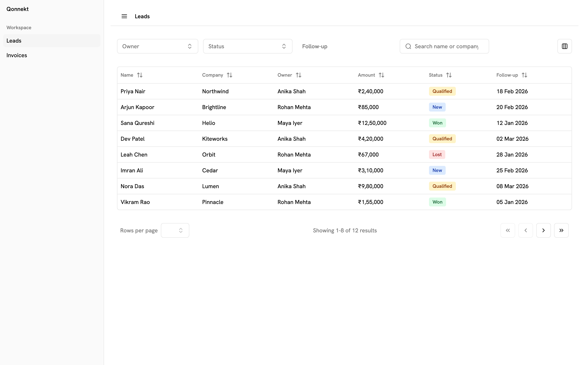
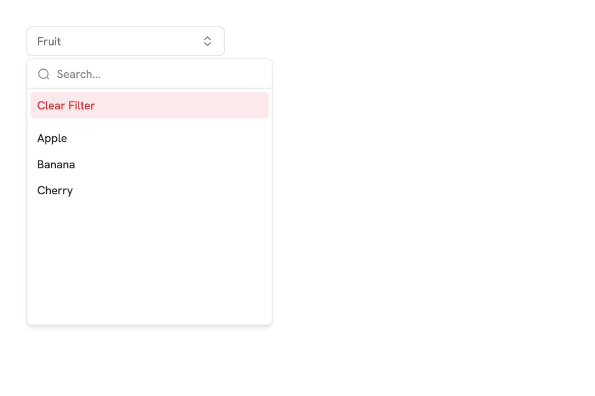
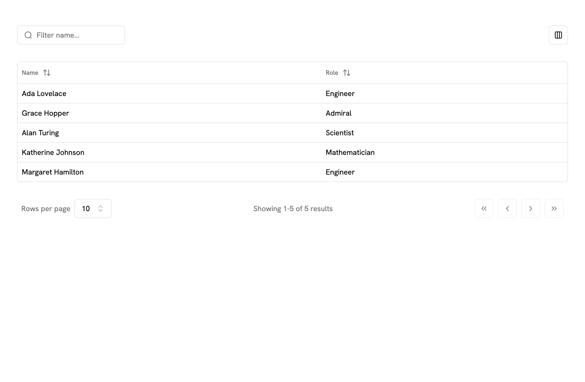
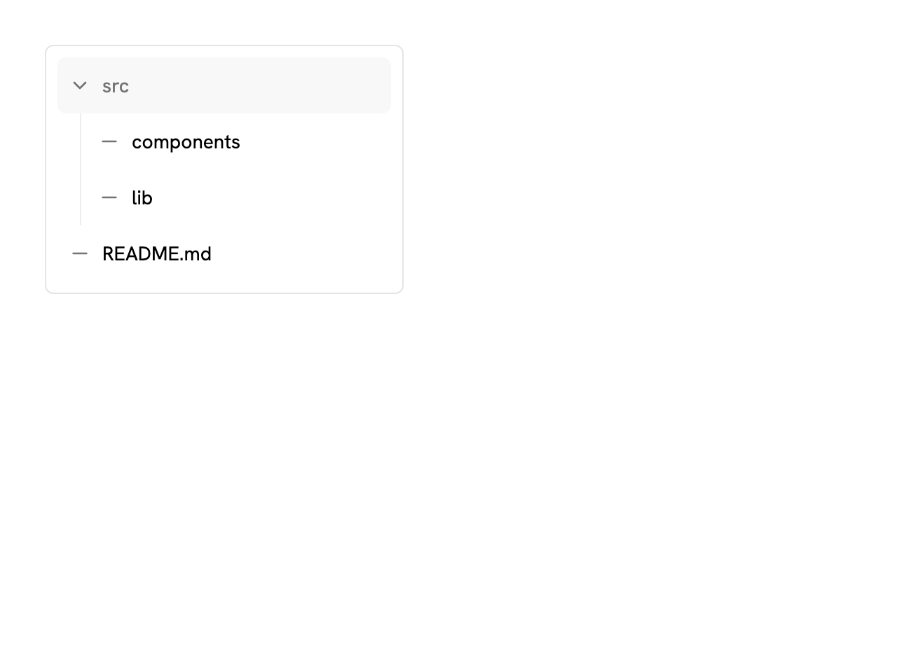

# Qonnekt UI

Batteries-included React UI kit for starting a product: tokens, a full primitive/overlay/form catalog, and production composites (searchable selects, data table, domain inputs, tree view).

Built on [Radix](https://www.radix-ui.com/) primitives and [shadcn/ui](https://ui.shadcn.com) patterns, retokened for Qonnekt (Untitled UI icons, Tailwind v4). The composites were built for real product screens.

**Status:** `0.1.0` — source + Storybook. **Not published to npm.**

**[Live Storybook](https://anuragjoshidev.github.io/qonnekt-ui/)**

See **Examples → Leads workspace** in Storybook for a full screen that uses both layers (sidebar, filters, table, currency, chips).



<p align="center">
  
  
  
</p>

## What this is

- A **starter UI kit** you can wire into a React 19 + Tailwind v4 app
- Complete catalog: primitives, overlays, navigation, forms, charts, sidebar
- Qonnekt composites on top: `SelectSearch`, `DataTable`, currency/phone/tags, `TreeView`
- Defaults that match the product: **INR / `en-IN`**, display dates as `dd MMM yyyy`

It is **not** a from-scratch design system, and it is **not** a Next.js app template. Clone this repo for the kit; scaffold routing and data fetching in your app.

## Install

Not on npm. Use it from source:

```bash
git clone https://github.com/anuragjoshidev/qonnekt-ui.git
cd qonnekt-ui
npm install
npm run build
```

Peer dependencies: `react` and `react-dom` ^19.

Link or pack `dist/` into an app. Do not `npm i qonnekt-ui` until a registry release exists.

## Setup

1. Import the theme (required):

```ts
import "qonnekt-ui/theme.css";
```

2. Ensure Tailwind v4 scans the package (so utility classes inside `qonnekt-ui` are generated). In your CSS:

```css
@import "tailwindcss";
@import "qonnekt-ui/theme.css";
@source "../node_modules/qonnekt-ui/dist";
```

Adjust the `@source` path to match your app layout.

3. Import components by path:

```tsx
import { Button } from "qonnekt-ui/button";
import { DatePicker } from "qonnekt-ui/date-picker";
import { Toaster, toast } from "qonnekt-ui/toaster";
```

## Original composites

These are the product-layer APIs. Everything else in the catalog is the supporting kit (Radix + shadcn patterns, Qonnekt tokens/icons).

| Component | Path | Role |
|-----------|------|------|
| SelectSearch | `qonnekt-ui/select-search` | Searchable single select, optional clear sentinel, async `onSearchChange` |
| SelectSearchMulti | `qonnekt-ui/select-search-multi` | Multi-select, select-all, optional apply-on-confirm |
| DataTable | `qonnekt-ui/data-table` | TanStack table: pin, filter, manual pagination, row selection |
| InputCurrency | `qonnekt-ui/input-currency` | Numeric currency field (default INR) |
| InputPhone | `qonnekt-ui/input-phone` | Dial-code + digits |
| InputTags | `qonnekt-ui/input-tags` | Tag picker with create |
| TreeView | `qonnekt-ui/tree-view` | Nested tree with badge/action slots |
| Chip / Tag / Badge | `qonnekt-ui/chip`, `tag`, `badge` | Selectable / removable / static labels |

```tsx
import { SelectSearch, SelectSearchTrigger, SelectSearchValue } from "qonnekt-ui/select-search";
import { DataTable } from "qonnekt-ui/data-table";
import { InputCurrency } from "qonnekt-ui/input-currency";
```

## Labels

| Component | Path | Interaction |
|-----------|------|-------------|
| Badge | `qonnekt-ui/badge` | Static status / metadata |
| Chip | `qonnekt-ui/chip` | Selectable toggle |
| Tag | `qonnekt-ui/tag` | Removable label |

## Components in 0.1.0

Import path is `qonnekt-ui/<path>`.

### Primitives

| Path | Primary exports |
|------|-----------------|
| `accordion` | `Accordion`, `AccordionItem`, `AccordionTrigger`, `AccordionContent` |
| `avatar` | `Avatar`, `AvatarImage`, `AvatarFallback`, `AvatarInitials` |
| `button` | `Button`, `buttonVariants` |
| `button-group` | `ButtonGroup`, `ButtonGroupSeparator`, `ButtonGroupText` |
| `checkbox` | `Checkbox` |
| `collapsible` | `Collapsible`, `CollapsibleTrigger`, `CollapsibleContent` |
| `item` | `Item`, `ItemContent`, `ItemTitle`, `ItemDescription`, … |
| `kbd` | `Kbd`, `KbdGroup` |
| `radio-group` | `RadioGroup`, `RadioGroupItem` |
| `separator` | `Separator` |
| `slider` | `Slider` |
| `switch` | `Switch` |
| `toggle` | `Toggle`, `toggleVariants` |
| `toggle-group` | `ToggleGroup`, `ToggleGroupItem` |

### Inputs

| Path | Primary exports |
|------|-----------------|
| `calendar` | `Calendar`, `CalendarDayButton` |
| `date-picker` | `DatePicker` |
| `date-range-picker` | `DateRangePicker` |
| `input` | `Input` |
| `input-currency` | `InputCurrency` |
| `input-group` | `InputGroup`, `InputGroupAddon`, `InputGroupInput`, … |
| `input-number` | `InputNumber` |
| `input-otp` | `InputOTP`, `InputOTPGroup`, `InputOTPSlot`, `InputOTPSeparator` |
| `input-password` | `InputPassword` |
| `input-phone` | `InputPhone` |
| `input-search` | `InputSearch` |
| `input-tags` | `InputTags`, `InputTagsTrigger`, `InputTagsContent`, … |
| `input-url` | `InputUrl` |
| `select` | `Select`, `SelectTrigger`, `SelectContent`, `SelectItem`, … |
| `select-search` | `SelectSearch`, `SelectSearchTrigger`, `SelectSearchContent`, … |
| `select-search-multi` | `SelectSearchMulti`, `SelectSearchMultiTrigger`, … |
| `textarea` | `Textarea` |
| `time-picker` | `TimePicker` |

### Overlays

| Path | Primary exports |
|------|-----------------|
| `alert-dialog` | `AlertDialog`, `AlertDialogTrigger`, `AlertDialogContent`, … |
| `command` | `Command`, `CommandInput`, `CommandList`, `CommandItem`, … |
| `context-menu` | `ContextMenu`, `ContextMenuTrigger`, `ContextMenuContent`, … |
| `dialog` | `Dialog`, `DialogTrigger`, `DialogContent`, … |
| `drawer` | `Drawer`, `DrawerTrigger`, `DrawerContent`, … |
| `dropdown-menu` | `DropdownMenu`, `DropdownMenuTrigger`, `DropdownMenuContent`, … |
| `hover-card` | `HoverCard`, `HoverCardTrigger`, `HoverCardContent` |
| `popover` | `Popover`, `PopoverTrigger`, `PopoverContent` |
| `sheet` | `Sheet`, `SheetTrigger`, `SheetContent`, … |
| `tooltip` | `Tooltip`, `TooltipTrigger`, `TooltipContent`, `TooltipProvider` |

### Navigation

| Path | Primary exports |
|------|-----------------|
| `breadcrumb` | `Breadcrumb`, `BreadcrumbList`, `BreadcrumbItem`, … |
| `menubar` | `Menubar`, `MenubarMenu`, `MenubarTrigger`, … |
| `navigation-menu` | `NavigationMenu`, `NavigationMenuList`, `NavigationMenuItem`, … |
| `pagination` | `Pagination`, `PaginationContent`, `PaginationLink`, … |
| `sidebar` | `Sidebar`, `SidebarProvider`, `SidebarTrigger`, `useSidebar`, … |
| `stepper` | `Stepper`, `StepperItem`, `StepperTrigger`, `StepperIndicator`, … |
| `tabs` | `Tabs`, `TabsList`, `TabsTrigger`, `TabsContent` |
| `tabs-underline` | `TabsUnderline`, `TabsUnderlineList`, `TabsUnderlineTrigger`, `TabsUnderlineContent` |

### Layout

| Path | Primary exports |
|------|-----------------|
| `aspect-ratio` | `AspectRatio` |
| `card` | `Card`, `CardHeader`, `CardTitle`, `CardContent`, … |
| `divider` | `Divider` |
| `resizable` | `ResizablePanelGroup`, `ResizablePanel`, `ResizableHandle` |
| `scroll-area` | `ScrollArea`, `ScrollBar` |

### Feedback

| Path | Primary exports |
|------|-----------------|
| `alert` | `Alert`, `AlertTitle`, `AlertDescription` |
| `empty` | `Empty`, `EmptyHeader`, `EmptyTitle`, `EmptyDescription`, … |
| `progress` | `Progress` |
| `progress-radial` | `ProgressRadial` |
| `skeleton` | `Skeleton` |
| `spinner` | `Spinner` |
| `toaster` | `Toaster`, `toast` |

### Forms

| Path | Primary exports |
|------|-----------------|
| `field` | `Field`, `FieldLabel`, `FieldDescription`, `FieldError`, … |
| `form` | `Form`, `FormField`, `FormItem`, `FormLabel`, `FormControl`, `FormMessage`, `FormFieldError`, `useFormField` |
| `help-text` | `HelpText` |
| `label` | `Label` |

### Labels

| Path | Primary exports |
|------|-----------------|
| `badge` | `Badge` |
| `chip` | `Chip` |
| `tag` | `Tag` |

### Data

| Path | Primary exports |
|------|-----------------|
| `chart` | `ChartContainer`, `ChartTooltip`, `ChartTooltipContent`, … |
| `data-table` | `DataTable`, `DataTableList`, `DataTableColumnHeader`, `DataTablePagination`, `DataTableViewOptions`, `createSelectColumn` |
| `table` | `Table`, `TableHeader`, `TableBody`, `TableRow`, `TableCell`, … |
| `tree-view` | `TreeView` |

### Theme & utilities

| Path | Primary exports |
|------|-----------------|
| `theme.css` | CSS tokens (required) |
| `theme-provider` | `ThemeProvider`, `useTheme` |
| `utils` | `cn` |
| `hooks/use-mobile` | `useIsMobile` |
| `lib/utils/date` | Date helpers (`formatDate`, presets, …) |
| `lib/utils/currency` | `formatCurrency`, `getCurrencySymbol`, … |
| `lib/utils/url` | `removeProtocol`, `detectProtocol`, … |
| `lib/filters/constants` | `FILTER_CLEAR`, `isFilterClear` |

## Dependencies (why they’re bundled)

This kit is meant to start an app with supporting libraries already in place. Radix, cmdk, CVA, and similar stay as `dependencies`. Heavier feature packages are also dependencies for the same reason:

| Package | Used by |
|---------|---------|
| `@tanstack/react-table` | DataTable |
| `recharts` | Chart |
| `react-hook-form`, `zod`, `@hookform/resolvers` | Form |
| `next-themes` | ThemeProvider |
| `@untitledui/icons` | Icons across the kit |

## Storybook

```bash
npm install
npm run storybook
```

Hosted docs (GitHub Pages): https://anuragjoshidev.github.io/qonnekt-ui/

## Scripts

| Command | Description |
|---------|-------------|
| `npm run build` | Build ESM + types to `dist/` |
| `npm run typecheck` | TypeScript check (src, stories, tests) |
| `npm test` | Vitest unit tests |
| `npm run lint` | ESLint on `src` |
| `npm run storybook` | Dev Storybook on :6006 |
| `npm run build-storybook` | Static Storybook to `storybook-static/` |
| `npm run ci` | typecheck + test + lint + build |

## Attribution

- [shadcn/ui](https://ui.shadcn.com) (MIT) — primitive/overlay/form patterns
- [Radix UI](https://www.radix-ui.com/)
- [Untitled UI icons](https://www.untitledui.com/icons)
- [TanStack Table](https://tanstack.com/table), [Recharts](https://recharts.org/), [React Hook Form](https://react-hook-form.com/)

## License

MIT
